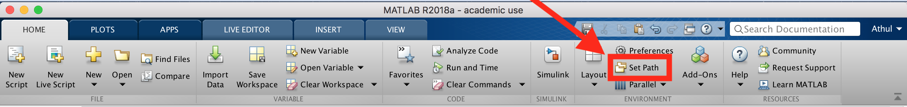
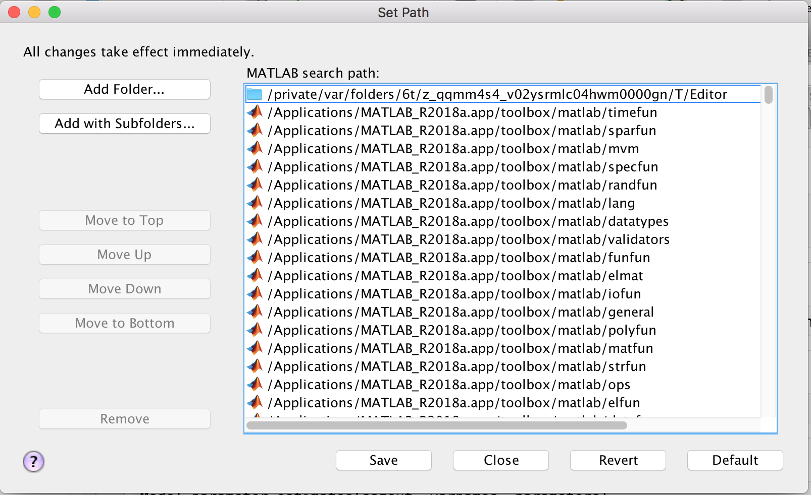

### Setting up your environment 

Before you start, make sure you have MATLAB R2018a or higher. Many files (*.mlx) won't work if you are using an older version of the the MATLAB 

To ensure everything works correctly, it is important that you setup the software path so MATLAB can find the right function libraries.

On clicking `Set Path`, a dialog box will pop up as shown in the below picture 

Click `Add Folder` and choose `ACN5314`. Also add `data` folder inside  `ACN5314`.

Once done, repeat `Set Path` once again, but this time choose `Add with Subfolders` and open `SMLAlgorithms` inside `SML Toolbox` folder

Once complete, `Save` and `Close` the `Set Path` dialog box.
