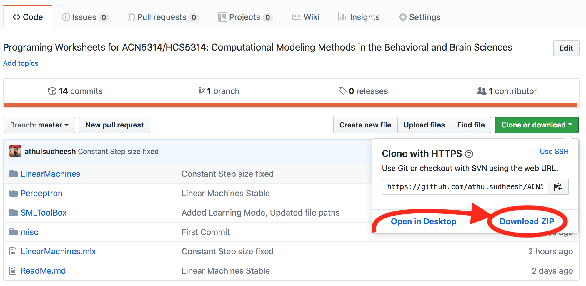

### <u>Software Status</u>

- [x] Linear Machines 
- [x] Perceptron
- [x] Lunar Lander

## Downloading the Software 



## Setting up your environment 

Before you start, make sure you have MATLAB R2018a or higher. Many files (*.mlx) won't work if you are using an older version of the the MATLAB 

To ensure everything works correctly, it is important that you setup the software path so MATLAB can find the right function libraries.

Open the `SMLalgorithms` Folder (`ACN5314` &rarr; `SMLToolBox` &rarr; `SMLalgorithms`)

Now run

```matlab
updatesoftwarepath; % Asks MATLAB to look into SMLalgorithms while you run programs in this session
```


# Running the models 

- Linear Machines 
  Open `LinearMachines.mlx`
- Perceptron
  Open `Perceptron.mlx`

